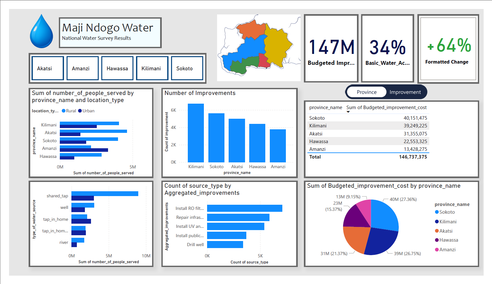
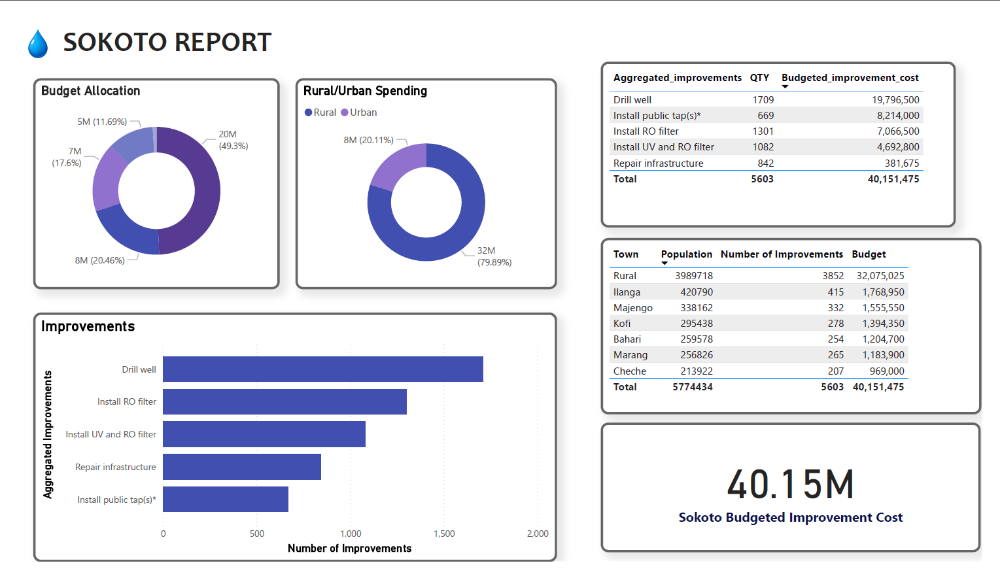
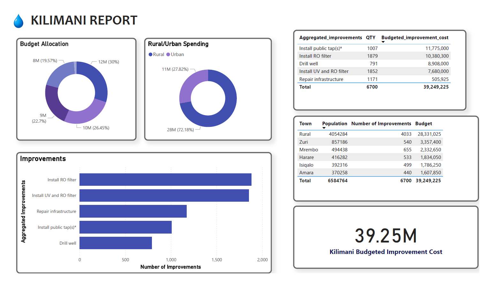
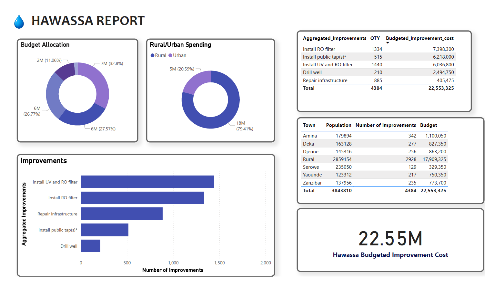
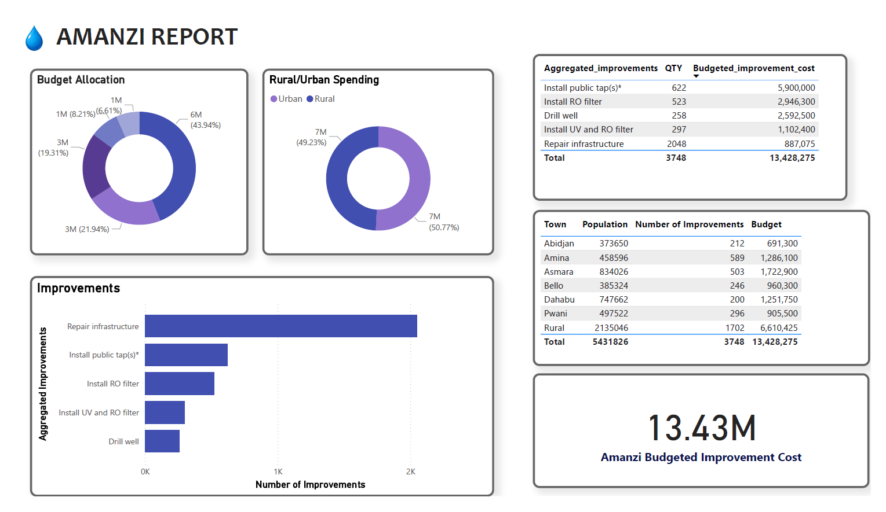
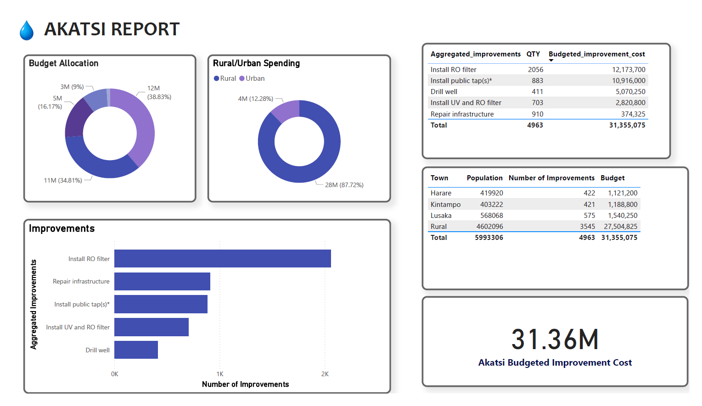

## Restoring-Water-Access-Visualization-Part-3
Communicating our findings in maji ndogo

### Table of Contents
- [Project Overview](#project-overview)
- [Data Sources](#data-sources)
- [Exploratory Data Analysis (EDA)](#exploratory-data-analysis-eda)
- [Data Analysis Steps](#data-analysis-steps)
- [Insights](#insights)
- [Summary and Recommendation](#summary-and-recommendation)

---

### Project Overview
This project supports the Maji Ndogo leadership team to understand the water access landscape in Maji Ndogo, both at national and provincial levels. The project aims to answer:

- Who lacks access to basic water?  
- Where are they located?  
- What upgrades are needed?  
- How much will these upgrades cost?

The final deliverable is an interactive Power BI report designed around key user stories to enable data-driven decision-making.

---

###  Data Sources
[`Md_water_services_data.xlsx`](Md_water_services_data.xlsx)

---

### Exploratory Data Analysis (EDA)
**Key Questions Explored:**

- What is the current water access situation at national and provincial levels?  
- What types of water sources exist, and how are they distributed between urban and rural areas?  
- How many people lack access to basic water?   
- What improvements are needed, and where?  
- What are the total and disaggregated costs of improvements?

---

### Data Analysis Steps

Mapped user stories into report visuals

**Cleaned and aggregated data on:**
- Water source types  
- Population served  
- Infrastructure conditions  

**Created calculated columns/measures:**
- `Rural_adjusted_cost`: Added 50% to rural unit costs  
- `Budgeted_improvement_cost`: Adjusted by type and rural/urban classification  
- `Basic_water_access`: Defined based on contamination, queue time, and tap type  
- `Access once_complete` and `Formatted_change`: Show expected improvements  

Implemented **drill-throughs** and **bookmarks** for province-level analysis.

Grouped improvement types using **DAX** for simplified reporting (e.g., _Install public tap(s)_).

---

### Insights

#### National Population Overview
- **Budgeted improvement cost (National):** $146,737,375  
- **Basic water access:** Only 34% of the population currently has access  
- **Below Basic Access:** 66% of the population requires upgrades  

---
  

  

  

  

  

#### Provincial Access Overview
- **Sokoto** has the highest improvement budget, followed by **Kilimani**  
- Both have predominantly rural sources, requiring costly interventions like well drilling and R.O. filter installation  
- **Amanzi** has the lowest budgeted cost, with mostly urban infrastructure requiring minor repairs  

#### Source Distribution
- Rural sources outnumber urban sources by more than **2:1** across most provinces  
- **Amanzi** is the only province with a majority of urban water sources  

#### Improvement Needs
- **Installing public taps** contributes the largest share of improvement costs  
- Highlights its importance in bridging water access gaps  

---

### Summary and Recommendation

#### Summary
- **66%** of Maji Ndogo's population lacks basic water access  
- High-cost, high-need areas are concentrated in rural provinces  
- Costly improvements include Installation of public taps,well drilling and filtration systems  
- The interactive report allows national and provincial leaders to **filter**, **explore**, and **understand** their local needs  

#### Recommendation
Prioritize action in rural provinces with:

- The **highest population** without basic access  
- The **highest infrastructure costs**  
- Enable localized planning by empowering provincial leaders with tailored data views. These insights will ensure funding is directed where it will have the greatest impact, accelerating progress toward **universal water access**.

